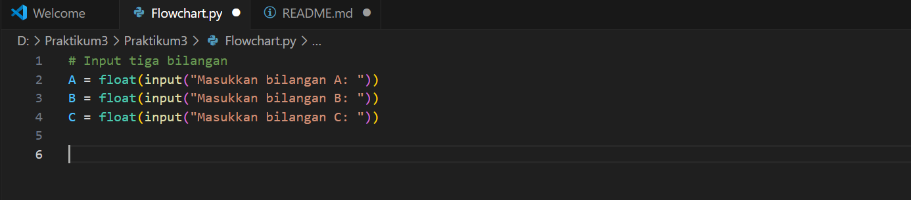
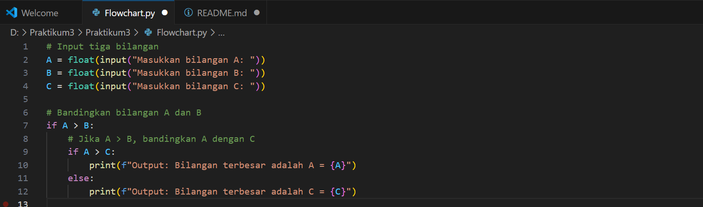
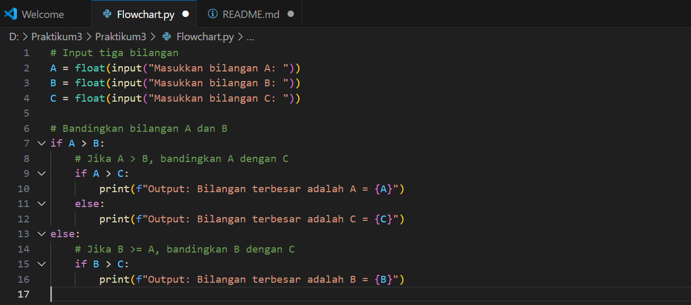
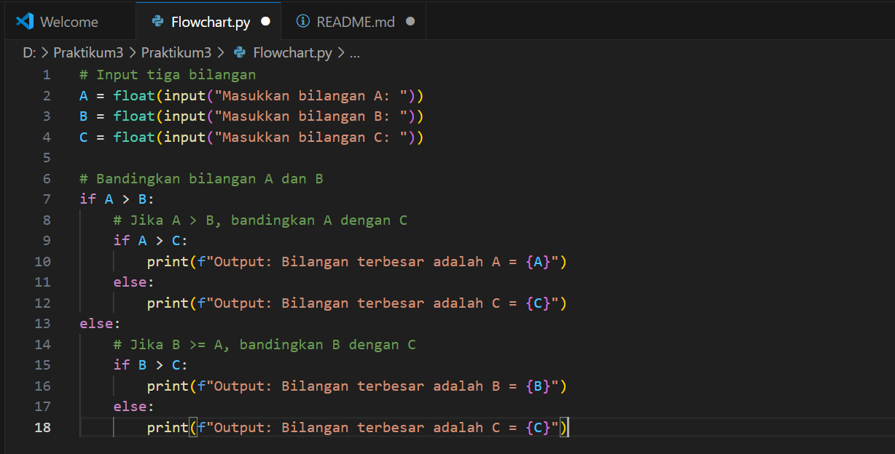

# Praktikum3
## Cara Membuat Ripository dan Akun Github

### Cara 1:
Sebelum membuat Repository kita terlebih dahulu membuat akun github. buka chrome lalu ketik "github.com", setelah itu kita membuat akun github. setelah itu akan muncul seperti gambar dibawah:

### Cara 2:
Setelah tampilan layar muncul, kita klik "new" untuk memnbuat Repository:

Setelah tampilan muncul, klik isi nama Repository lalu setting publik jangan lupa klik "add a README.md" seperti pada gambar:

Lalu klik Create Repository:

Hasil dari langkah-langkah pembuatan Repository:

## Mendownload Git Tools

### Mendownload Git Tools di Git web SCM
Buka chrome lalu tulis "git scm" lalu klik pencarian. klik website git scm lalu akan muncul seperti gambar dibawah ini:

lalu klik "Download".

Akan muncul tampilan sebagai berikut:

Pilih salah satu link download sesuai dengan spek laptop masing-masing.

lalu klik "next" sampai muncul tulisan "install":

Setelah muncul tulisan "install" di klik:

Tunggu beberapa saat, setelah ter-install klik "finish" seperti digambar:

### Menjalankan/Pengoperasian Git Tools

## Kode Program Flowchart Menggunakan Python

### Langkah 1
Sebelum kita mambuat kode program terlebih dahulu kita membuat file python yang telang dihubungkan ke repository. setelah membuat file python, kita buat kode program flowchart menggunakan python. setelah dibuat buat kode program lalu input tiga bilangan A, B, dan C yang dikonversi ke tipe float:

### Langkah 2
Bandingkan bilangan A dengan B. jika A lebih besar dari B, maka dilanjutkan untuk membandingkan A dengan C. begitu pula dengan membandingkan A dengan C. jika A lebih besar dari C, maka output hasil bahwa bilangan A lebih besar:

### Langkah 3
Penggunaan else: Jika A tidak lebih besar dari C (artinya C >= A), maka C adalah bilangan terbesar:

Jika B lebih besar dari A, lalu membandingkan B dengan C. Jika B lebih besar dari C, maka B adalah bilangan terbesar:

### Langkah 4
Membandingkan B dengan A dan B dengan C: Jika B lebih besar dari A, membandingkan B dengan C. Jika B lebih besar dari C, maka B adalah bilangan terbesar:

Jika B tidak lebih besar dari C (artinya C >= B), maka C adalah bilangan terbesar:

### Langkah 5
Setelah kita membuat kode program jangan lupa di run dan memberi nilai pada bilangan A,B. dan C. bilangan A = 1, bilangan B = 2, Bilangan C  = 3:
